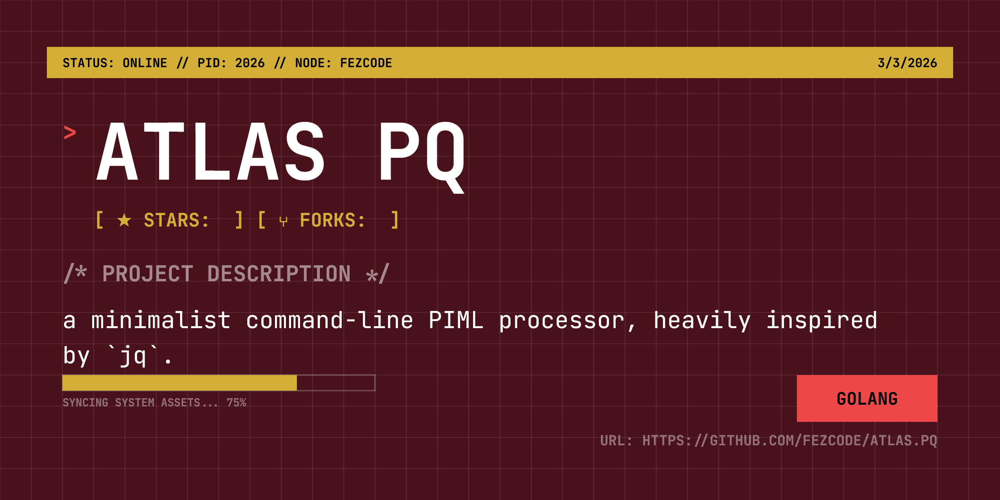

# atlas.pq 🛰️



`atlas.pq` is a minimalist command-line PIML processor, heavily inspired by `jq`. It allows you to slice, filter, and map PIML data with ease using simple dot notation.

## Features

- **Dot Notation:** Access nested fields and array indices (e.g., `tools.0.name`).
- **JSON Output:** Converts PIML data to structured JSON for piping into other tools.
- **Raw Mode:** Output unquoted strings, perfect for shell scripts.
- **Compact Mode:** Minified JSON output for performance.
- **Pipe Support:** Reads from `stdin` or files.

## Installation

Install via **atlas.hub**:

```bash
atlas.hub
```

Or build from source using **gobake**:

```bash
gobake build
```

## Usage

```bash
atlas.pq [options] [file.piml]
```

### Options

- `-q string`: The query string (default: `.`)
- `-r`: Raw output (don't quote strings)
- `-c`: Compact JSON output
- `-v`: Show version
- `-h`: Show help

### Examples

**Accessing a field:**
```bash
atlas.pq -q "(name)" config.piml
```

**Accessing an array element:**
```bash
atlas.pq -q "tools.0.version" manifest.piml
```

**Extracting a raw value for a script:**
```bash
VERSION=$(atlas.pq -r -q "version" recipe.piml)
```

**Piping data:**
```bash
cat data.piml | atlas.pq -q "metadata.author"
```

## License

MIT
